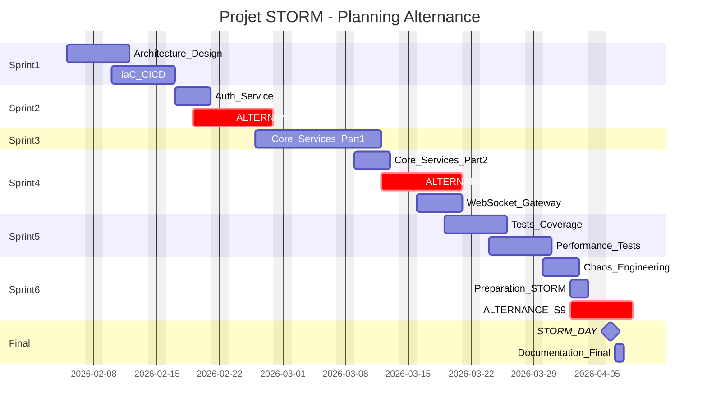

# Découpage Projet STORM - Epics & Tickets

## Informations projet

| Élément | Valeur |
|---------|--------|
| **Date de début** | 5 février 2026 |
| **Deadline** | 7 avril 2026 |
| **Durée totale** | 9 semaines |
| **Équipe** | 4-5 personnes |
| **Contrainte** | Alternance (1 semaine sur 3 à productivité réduite) |

---

## Vue d'ensemble du projet

**Objectifs :**

- 100 000 connexions simultanées
- 500 000 messages/seconde
- Budget max : 700€

**Stack choisie :** Go + PostgreSQL + Redis + Kafka/NATS + Kubernetes

---

## Calendrier avec alternance

```
Février 2026
┌────────────────────────────────────────────────────────────┐
│ Sem 1 (5-11)   │ ████████████ │ 100% │ Architecture       │
│ Sem 2 (12-18)  │ ████████████ │ 100% │ Architecture + Dev │
│ Sem 3 (19-25)  │ ██████░░░░░░ │ 50%  │ ALTERNANCE         │
│ Sem 4 (26-4)   │ ████████████ │ 100% │ Développement      │
└────────────────────────────────────────────────────────────┘

Mars 2026
┌────────────────────────────────────────────────────────────┐
│ Sem 5 (5-11)   │ ████████████ │ 100% │ Développement      │
│ Sem 6 (12-18)  │ ██████░░░░░░ │ 50%  │ ALTERNANCE         │
│ Sem 7 (19-25)  │ ████████████ │ 100% │ Tests + Perf       │
│ Sem 8 (26-1)   │ ████████████ │ 100% │ Chaos + Prep       │
└────────────────────────────────────────────────────────────┘

Avril 2026
┌────────────────────────────────────────────────────────────┐
│ Sem 9 (2-7)    │ ██████░░░░░░ │ 50%  │ STORM DAY + Final  │
└────────────────────────────────────────────────────────────┘

Capacité effective : ~7 semaines sur 9 (alternance = 50%)
```

---

## Planning par phase (ajusté)



---

## EPIC 1 - Architecture & Infrastructure (Priorité: Critique)

**Sprint :** 1 (Semaine 1-2)  
**Responsable suggéré :** DevOps / Lead Tech

| Ticket | Description | Est. | Priorité |
|--------|-------------|------|----------|
| ARCH-1 | Design du schéma d'architecture système (diagramme C4) | M | P0 |
| ARCH-2 | Définition des contrats API (OpenAPI/Swagger) | M | P0 |
| ARCH-3 | Setup Terraform/Pulumi pour l'infrastructure AWS/GCP | L | P0 |
| ARCH-4 | Configuration Kubernetes (EKS/GKE) avec Helm charts | L | P1 |
| ARCH-5 | Pipeline CI/CD avec GitHub Actions (build, test, deploy) | M | P0 |
| ARCH-6 | Configuration des environnements (dev, staging, prod) | S | P1 |

---

## EPIC 2 - Authentification & Sécurité (Priorité: Critique)

**Sprint :** 2 (Semaine 2-3)  
**Responsable suggéré :** Backend Dev 1

| Ticket | Description | Est. | Priorité |
|--------|-------------|------|----------|
| AUTH-1 | Microservice Auth : inscription/connexion JWT | M | P0 |
| AUTH-2 | Gestion des refresh tokens | S | P1 |
| AUTH-3 | Middleware d'authentification pour l'API Gateway | S | P0 |
| AUTH-4 | Rate limiting et protection DDoS | M | P1 |
| AUTH-5 | Intégration scan sécurité (Snyk/Trivy) dans CI | S | P2 |
| AUTH-6 | Chiffrement des données sensibles (mots de passe bcrypt) | S | P0 |

---

## EPIC 3 - Core Microservices (Priorité: Critique)

**Sprint :** 3-4 (Semaine 4-6)  
**Responsable suggéré :** Backend Dev 2 + Backend Dev 3

| Ticket | Description | Est. | Priorité |
|--------|-------------|------|----------|
| CORE-1 | User Service : CRUD utilisateurs, profils, statuts | M | P0 |
| CORE-2 | Channel Service : création/gestion des salons | M | P0 |
| CORE-3 | Message Service : envoi/réception/historique messages | L | P0 |
| CORE-4 | Presence Service : gestion online/offline/typing | M | P1 |
| CORE-5 | Notification Service : push notifications | M | P2 |
| CORE-6 | Media Service : upload/stockage fichiers (S3) | M | P2 |
| CORE-7 | Search Service : recherche dans les messages | L | P3 |

---

## EPIC 4 - Temps Réel & Communication (Priorité: Critique)

**Sprint :** 4 (Semaine 5-6)  
**Responsable suggéré :** Backend Dev 1 + Lead Tech

| Ticket | Description | Est. | Priorité |
|--------|-------------|------|----------|
| RT-1 | WebSocket Gateway avec gorilla/websocket | L | P0 |
| RT-2 | Gestion du connection pooling (100K connexions) | L | P0 |
| RT-3 | Setup message broker Kafka/NATS | M | P0 |
| RT-4 | Publication/souscription des événements temps réel | M | P0 |
| RT-5 | Heartbeat et reconnexion automatique | S | P1 |
| RT-6 | Broadcast optimisé pour les channels | M | P1 |

---

## EPIC 5 - Base de Données & Cache (Priorité: Haute)

**Sprint :** 2-3 (en parallèle des autres)  
**Responsable suggéré :** Backend Dev 2

| Ticket | Description | Est. | Priorité |
|--------|-------------|------|----------|
| DB-1 | Schéma PostgreSQL optimisé (partitioning messages) | M | P0 |
| DB-2 | Setup Redis pour cache et sessions | S | P0 |
| DB-3 | Connection pooling avec pgxpool | S | P0 |
| DB-4 | Stratégie de sharding pour scalabilité | L | P2 |
| DB-5 | Migrations avec golang-migrate | S | P1 |
| DB-6 | Backup automatisé et recovery plan | M | P2 |

---

## EPIC 6 - Observabilité (Priorité: Moyenne)

**Sprint :** 4-5  
**Responsable suggéré :** DevOps

| Ticket | Description | Est. | Priorité |
|--------|-------------|------|----------|
| OBS-1 | Setup Prometheus + Grafana | M | P1 |
| OBS-2 | Dashboards métriques (latence, throughput, errors) | M | P1 |
| OBS-3 | Logging centralisé avec ELK ou Loki | M | P2 |
| OBS-4 | Distributed tracing avec Jaeger | M | P2 |
| OBS-5 | Alerting (PagerDuty/Slack) | S | P2 |
| OBS-6 | Définition des SLOs (latence p99 < 100ms, uptime 99.9%) | S | P1 |

---

## EPIC 7 - Tests & Qualité (Priorité: Haute)

**Sprint :** 5 (Semaine 7)  
**Responsable suggéré :** Tous (chacun ses services)

| Ticket | Description | Est. | Priorité |
|--------|-------------|------|----------|
| TEST-1 | Tests unitaires User Service (>80% coverage) | M | P0 |
| TEST-2 | Tests unitaires Message Service (>80% coverage) | M | P0 |
| TEST-3 | Tests unitaires autres services (>80% coverage) | M | P0 |
| TEST-4 | Tests d'intégration API (testcontainers) | L | P1 |
| TEST-5 | Tests E2E des flux critiques | M | P1 |
| TEST-6 | Mocking des dépendances externes | S | P2 |

---

## EPIC 8 - Performance (Priorité: Haute)

**Sprint :** 5 (Semaine 7-8)  
**Responsable suggéré :** Lead Tech + Backend Dev 3

| Ticket | Description | Est. | Priorité |
|--------|-------------|------|----------|
| PERF-1 | Setup K6/Locust pour tests de charge | M | P0 |
| PERF-2 | Benchmark 10K connexions simultanées | M | P0 |
| PERF-3 | Benchmark 100K connexions simultanées | L | P0 |
| PERF-4 | Benchmark 500K msg/sec throughput | L | P1 |
| PERF-5 | Profiling CPU/mémoire avec pprof | M | P1 |
| PERF-6 | Optimisations basées sur les benchmarks | L | P1 |

---

## EPIC 9 - Chaos Engineering (Priorité: Moyenne)

**Sprint :** 6 (Semaine 8)  
**Responsable suggéré :** DevOps + Lead Tech

| Ticket | Description | Est. | Priorité |
|--------|-------------|------|----------|
| CHAOS-1 | Setup Chaos Monkey / Litmus | M | P1 |
| CHAOS-2 | Simulation kill de pods aléatoires | S | P1 |
| CHAOS-3 | Simulation latence réseau | S | P1 |
| CHAOS-4 | Simulation panne base de données | M | P1 |
| CHAOS-5 | Simulation spike de trafic | M | P1 |
| CHAOS-6 | Runbook de recovery pour chaque scénario | M | P0 |

---

## EPIC 10 - Documentation & STORM DAY (Priorité: Haute)

**Sprint :** 6 + Final (Semaine 8-9)  
**Responsable suggéré :** Tous

| Ticket | Description | Est. | Priorité |
|--------|-------------|------|----------|
| DOC-1 | Documentation architecture (ADRs) | M | P1 |
| DOC-2 | Documentation API (Swagger UI) | S | P1 |
| DOC-3 | Guide de déploiement et runbook | M | P0 |
| DOC-4 | Préparation STORM DAY (checklist, rôles) | M | P0 |
| DOC-5 | Post-mortem template et processus | S | P0 |
| DOC-6 | Rapport technique final et soutenance | L | P0 |

---

## Répartition suggérée par rôle (4-5 personnes)

```
┌─────────────────────────────────────────────────────────────────┐
│                      RÉPARTITION ÉQUIPE                         │
├─────────────────┬───────────────────────────────────────────────┤
│ Lead Tech       │ Architecture, WebSocket Gateway, Performance, │
│                 │ Code Reviews, Coordination                    │
├─────────────────┼───────────────────────────────────────────────┤
│ Backend Dev 1   │ Auth Service, Presence Service,               │
│                 │ Notification Service, WebSocket               │
├─────────────────┼───────────────────────────────────────────────┤
│ Backend Dev 2   │ User Service, Channel Service,                │
│                 │ Database & Cache                              │
├─────────────────┼───────────────────────────────────────────────┤
│ Backend Dev 3   │ Message Service, Media Service,               │
│                 │ Search Service, Performance                   │
├─────────────────┼───────────────────────────────────────────────┤
│ DevOps          │ Infrastructure, CI/CD, Observabilité,         │
│                 │ Chaos Engineering                             │
└─────────────────┴───────────────────────────────────────────────┘
```

---

## Vue Sprint par Sprint

### Sprint 1 (5-18 février) - Foundation
| Qui | Tickets |
|-----|---------|
| Lead Tech | ARCH-1, ARCH-2 |
| DevOps | ARCH-3, ARCH-5 |
| Backend Dev 1 | AUTH-1, AUTH-3 |
| Backend Dev 2 | DB-1, DB-2, DB-3 |
| Backend Dev 3 | CORE-1 (début) |

### Sprint 2 (19 fév - 4 mars) - Core Dev (inclut alternance)
| Qui | Tickets |
|-----|---------|
| Lead Tech | ARCH-4, RT-1 (début) |
| DevOps | ARCH-6, CI/CD polish |
| Backend Dev 1 | AUTH-2, AUTH-4, AUTH-6 |
| Backend Dev 2 | CORE-1, CORE-2 |
| Backend Dev 3 | CORE-3 (début) |

### Sprint 3 (5-18 mars) - Services & Real-time (inclut alternance)
| Qui | Tickets |
|-----|---------|
| Lead Tech | RT-1, RT-2 |
| DevOps | OBS-1, OBS-2 |
| Backend Dev 1 | RT-3, RT-4, CORE-4 |
| Backend Dev 2 | CORE-2, DB-5 |
| Backend Dev 3 | CORE-3, CORE-5 |

### Sprint 4 (19-31 mars) - Tests & Performance
| Qui | Tickets |
|-----|---------|
| Lead Tech | PERF-1, PERF-2, PERF-3 |
| DevOps | OBS-3, OBS-4 |
| Backend Dev 1 | TEST-1, RT-5, RT-6 |
| Backend Dev 2 | TEST-2, TEST-4 |
| Backend Dev 3 | TEST-3, PERF-4, PERF-5 |

### Sprint 5 (1-6 avril) - Chaos & Final (alternance)
| Qui | Tickets |
|-----|---------|
| Lead Tech | CHAOS-6, DOC-4, coordination |
| DevOps | CHAOS-1 à CHAOS-5 |
| Backend Dev 1 | DOC-1, préparation |
| Backend Dev 2 | DOC-2, DOC-3 |
| Backend Dev 3 | PERF-6, optimisations |

### STORM DAY (6 avril)
- Toute l'équipe mobilisée
- Simulation 100K utilisateurs
- Gestion des incidents en temps réel

### Final (7 avril)
- DOC-5 : Post-mortems
- DOC-6 : Rapport final
- Soutenance

---

## Priorités

| Label | Signification |
|-------|---------------|
| **P0** | Bloquant - Doit être fait en premier |
| **P1** | Important - Nécessaire pour le MVP |
| **P2** | Nice to have - Si temps disponible |
| **P3** | Optionnel - Bonus |

---

## Légende estimations

- **S** (Small) : 1-2 jours
- **M** (Medium) : 3-5 jours  
- **L** (Large) : 5-10 jours

---

## Résumé

| Métrique | Valeur |
|----------|--------|
| Total Epics | 10 |
| Total Tickets | 60 |
| Tickets P0 (critiques) | 24 |
| Tickets P1 (importants) | 22 |
| Tickets P2-P3 (optionnels) | 14 |
| Sprints | 5 + STORM DAY + Final |
| Deadline | 7 avril 2026 |
